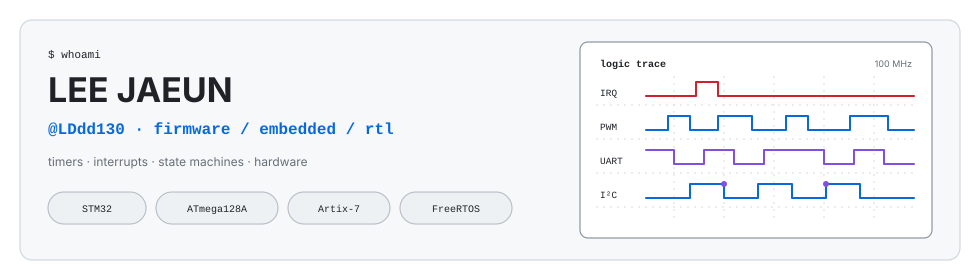

<div align="center">




<br/>


<br/>

<p><strong>센서를 읽고, 시간을 맞추고, 상태를 나눠 실제 하드웨어를 움직이는 코드를 작성합니다.</strong></p>

<p>STM32·AVR 펌웨어와 Verilog RTL을 주로 다룹니다.<br/>
동작 영상, 구조도, 구현 내용과 확인된 제한 사항은 각 프로젝트 README에 기록했습니다.</p>

</div>

---

## `toolbox`

### Firmware

<p>
  
  &nbsp;
  
  &nbsp;
  
  &nbsp;
  
</p>

### RTL / SoC

<p>
  
  &nbsp;
  
  &nbsp;
  
  &nbsp;
  
</p>

### Tools / Host

<p>
  
  &nbsp;
  
  &nbsp;
  
</p>

---

## `workbench`

```text
firmware  Timer · ISR · peripheral driver · FreeRTOS task
control   Sensor · motor · servo · watchdog
rtl       Synchronous logic · AXI4-Lite · testbench
host      UART protocol · telemetry · PySide6 dashboard
```

---

## `projects`

| Project | 구현 내용 | Stack |
|:--|:--|:--|
| [**PR_CAR**](https://github.com/LDdd130/PR_CAR) | SensorTask → 값 복사 큐 → MotorTask 구조의 RC카. ToF·IMU·엔코더를 주행 입력으로 사용하고, 신선한 센서 프레임 수신 시에만 IWDG 갱신 | `STM32F411CEU6` `FreeRTOS` `C` |
| [**Mission SoC**](https://github.com/LDdd130/SOC_Project) | `heartbeat_monitor → fault_manager → safety_controller` Custom IP 연결. MicroBlaze는 설정·IRQ 수집, PySide6는 모니터링 담당 | `Basys 3` `Verilog` `C` `Python` |
| [**MimicArm**](https://github.com/LDdd130/MimicArm) | Teach & Playback 로봇 팔. D-FF 자세 저장, ±1° 증분 보간, 상수·곱셈 기반 서보 PWM | `Artix-7` `Verilog` |
| [**Smart Fan**](https://github.com/LDdd130/Smart_Fan) | DHT11 팬 듀티, 조이스틱 2축 서보, UART 카운트다운을 Timer2 기반 협력식 주기 실행으로 구성 | `ATmega128A` `C` `CMake` |
| [**Elevator On-Device**](https://github.com/LDdd130/Elevater) | 초음파 2채널 층 판정, 문 인터록, 스텝모터 이동, Bluetooth 층 호출 | `STM32F411RE` `HAL` `C` |

<br/>

<div align="center">

<a href="https://github.com/LDdd130">
  
</a>

<br/><br/>

<sub>프로젝트 설명과 수치는 각 저장소의 소스 및 설정값을 기준으로 작성했습니다.</sub>


</div>
